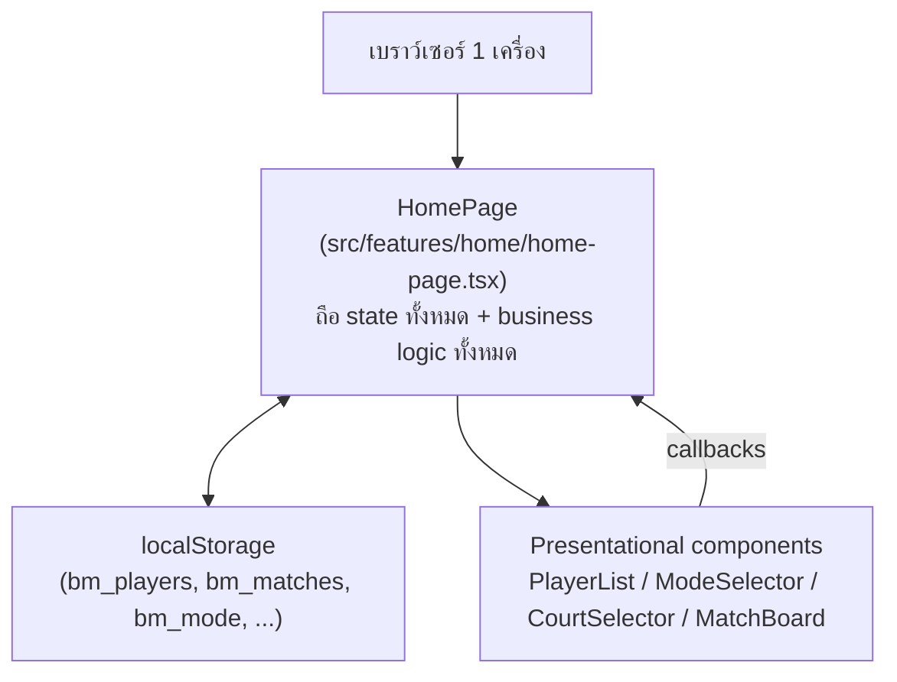
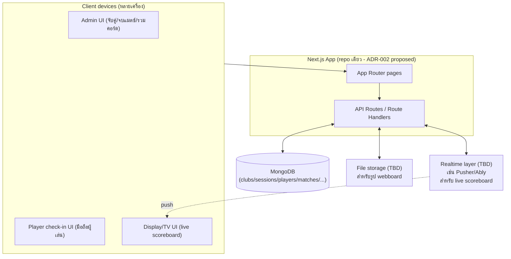

# Architecture Design

## สถาปัตยกรรมปัจจุบัน (v0.4.2)



ลักษณะสำคัญ:

- **ไม่มี backend เลย** — ทุกอย่างรันในเบราว์เซอร์
- **God component**: `HomePage` ถือทั้ง state, handlers, matching algorithm, และ modal ทั้งหมดในไฟล์เดียว (~1500 บรรทัด) — component ย่อยอื่น ๆ เป็น presentational ล้วน รับ props/callback เท่านั้น
- **Persistence**: ผ่าน custom hook [useLocalStorage.ts](../src/lib/useLocalStorage.ts) — sync แบบ synchronous ในเบราว์เซอร์เดียว ไม่มี cross-device sync ไม่มี conflict resolution
- ข้อดี: deploy ง่าย (static/edge ได้เลย), ไม่มีต้นทุน infra, เหมาะกับ use case "1 คนถือมือถือคุมทั้งกลุ่ม"
- ข้อจำกัด: บล็อกฟีเจอร์ multi-device ทั้งหมดตามที่วิเคราะห์ใน [decision-log.md#adr-001](./decision-log.md)

## สถาปัตยกรรมเป้าหมาย (Phase 0+)



จุดที่ยังไม่ตัดสินใจ (ต้อง confirm ก่อนเริ่ม Phase 0 จริง):

- **Auth**: ใครมีสิทธิ์กด "จับคู่/จบแมตช์/รวมคอร์ด" (admin) เทียบกับผู้เล่นทั่วไปที่แค่เช็คอิน/ดูจอ — จะใช้ระบบ auth แบบไหน (NextAuth + email/password, magic link, LINE Login, หรือแค่ PIN ต่อ session)
- **Realtime**: live scoreboard (ฟีเจอร์ข้อ 7) ต้องมี mechanism push ข้อมูลสด — เลือกระหว่าง 3rd-party realtime service, polling ถี่ ๆ, หรือ self-host WebSocket
- **File storage**: รูปภาพ webboard เก็บที่ไหน (Vercel Blob / Cloudinary / S3 / MongoDB GridFS)
- **Multi-tenancy**: จะรองรับหลายชมรมในระบบเดียว (`Club` entity) หรือ 1 deployment ต่อ 1 ชมรมพอ — ส่งผลกับ schema ทุกตัวใน [database-design.md](./database-design.md)

## แนวทาง Module ใหม่ (เสนอ)

```text
src/
  app/                     # เหมือนเดิม (pages/routing)
  features/
    matching/              # ย้าย logic จาก home-page.tsx มาที่นี่ (matching algorithm, court state)
    checkin/                # เช็คอิน 2 ขั้น + QR self check-in (Phase 2)
    webboard/                # โพสต์รายงาน (Phase 3)
    scoreboard/              # นับคะแนน + live score (Phase 4)
    tournament/              # bracket mode (Phase 5)
  server/
    api/                    # route handlers แยกตาม resource
    db/                      # connection + models (mongoose schemas)
    auth/                    # auth config
  components/               # ui components เดิม (คงไว้)
```

หมายเหตุ: การแตกไฟล์ `home-page.tsx` เป็น `features/matching/` ควรทำพร้อมกับ Phase 1 (แก้ matching algorithm) เพราะต้อง touch โค้ดส่วนนี้อยู่แล้ว ไม่ต้องแยกเป็นงาน refactor เดี่ยว ๆ ก่อน
