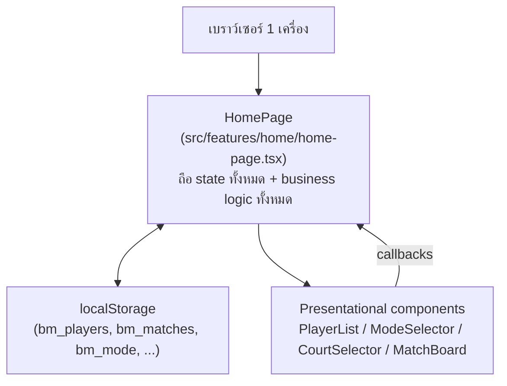
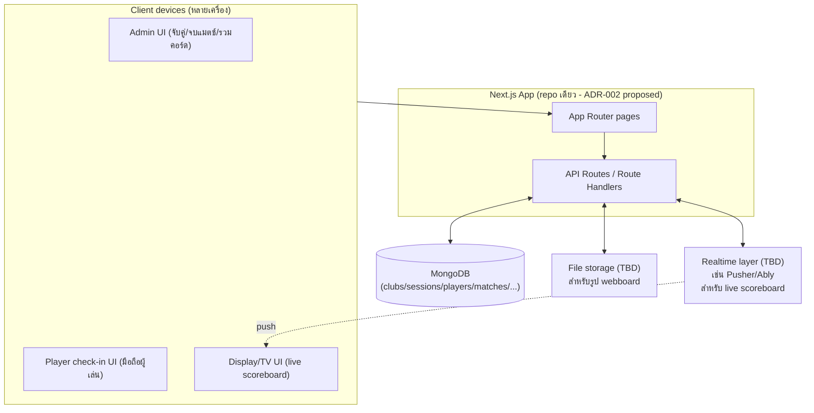

# Architecture Design

> **อัปเดต 2026-09-06:** ส่วน "สถาปัตยกรรมเป้าหมาย" ด้านล่าง implement ไปแล้วเป็นส่วนใหญ่ (MongoDB, PIN auth, API routes ทั้งหมดใน `src/app/api/`) — ดูสถานะละเอียดที่ [roadmap.md](./roadmap.md) ส่วน "สถาปัตยกรรมปัจจุบัน (v0.4.2)" ด้านล่างเก็บไว้เป็น**ประวัติ**อธิบายจุดเริ่มต้นก่อน refactor เท่านั้น ไม่ใช่สถานะปัจจุบันแล้ว

## สถาปัตยกรรมเดิมก่อน refactor (v0.4.2, historical)



ลักษณะสำคัญ:

- **ไม่มี backend เลย** — ทุกอย่างรันในเบราว์เซอร์
- **God component**: `HomePage` ถือทั้ง state, handlers, matching algorithm, และ modal ทั้งหมดในไฟล์เดียว (~1500 บรรทัด) — component ย่อยอื่น ๆ เป็น presentational ล้วน รับ props/callback เท่านั้น
- **Persistence**: ผ่าน custom hook `useLocalStorage.ts` (ลบไปแล้วตอน migrate เพราะไม่มีใครเรียกใช้แล้ว) — sync แบบ synchronous ในเบราว์เซอร์เดียว ไม่มี cross-device sync ไม่มี conflict resolution
- ข้อดี: deploy ง่าย (static/edge ได้เลย), ไม่มีต้นทุน infra, เหมาะกับ use case "1 คนถือมือถือคุมทั้งกลุ่ม"
- ข้อจำกัด: บล็อกฟีเจอร์ multi-device ทั้งหมดตามที่วิเคราะห์ใน [decision-log.md#adr-001](./decision-log.md)

## สถาปัตยกรรมเป้าหมาย (Phase 0+)



จุดที่ตัดสินใจแล้ว (2026-09-06):

- **Auth**: PIN ต่อ session — ดู [decision-log.md#adr-007](./decision-log.md)
- **Multi-tenancy**: 1 deployment ต่อ 1 ชมรม ไม่มี `Club` entity ใน Phase 0 — ดู [decision-log.md#adr-006](./decision-log.md)

จุดที่ยังไม่ตัดสินใจ (ต้อง confirm ก่อนถึงเฟสที่เกี่ยวข้อง):

- **Realtime**: live scoreboard (Phase 4) ต้องมี mechanism push ข้อมูลสด — เลือกระหว่าง 3rd-party realtime service, polling ถี่ ๆ, หรือ self-host WebSocket
- **File storage**: รูปภาพ webboard (Phase 3) เก็บที่ไหน (Vercel Blob / Cloudinary / S3 / MongoDB GridFS)

## โครงสร้าง Module จริง (ณ 2026-09-06)

```text
src/
  app/
    api/                   # route handlers แยกตาม resource (sessions, players, matches, partner-history)
    page.tsx, layout.tsx   # เหมือนเดิม
  features/
    home/home-page.tsx     # ยังเป็น container เดียวถือ business logic ทั้งหมด (ไม่ได้แตกเป็น features/matching/ ตามที่เคยเสนอ — ตัดสินใจไม่คุ้มที่จะแยกไฟล์ตอน migrate ครั้งนี้ เพราะ diff ใหญ่พอแล้ว)
    checkin/               # (Phase 2 — ยังไม่มี)
    webboard/              # (Phase 3 — ยังไม่มี)
    scoreboard/            # (Phase 4 — ยังไม่มี)
    tournament/            # (Phase 5 — ยังไม่มี)
  lib/
    api/sessionApi.ts      # typed fetch client ฝั่ง UI
    auth/pin.ts            # PIN hash/verify
    db/
      mongodb.ts           # connection singleton
      models/              # mongoose schemas
      services/matchLifecycle.ts  # shared stat/partner-history bump+revert
  components/              # ui components เดิม (คงไว้ ไม่ต้องแก้ตอน migrate เพราะรับแค่ props/callback)
```

หมายเหตุ: แผนเดิมเสนอ `src/server/` เป็น root แยกต่างหาก แต่ implement จริงใช้ Next.js convention (`src/app/api/` สำหรับ route handlers, `src/lib/` สำหรับ non-route backend code) แทน เพราะเข้ากับโครงสร้างเดิมของโปรเจกต์มากกว่า
